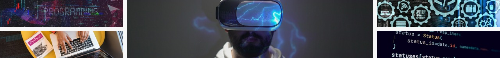

<h3 align="center">Hi There, I am Ronobir Dash.</h3>

As a seasoned web developer, I bring a dynamic blend of creativity and technical expertise to every project. With a passion for crafting immersive and user-friendly digital experiences, I specialize in translating ideas into elegant, functional websites. My skill set encompasses a wide range of technologies, including HTML, CSS, JavaScript, and various frameworks, allowing me to build responsive and visually stunning sites.

Driven by a commitment to staying ahead of industry trends, I thrive on tackling challenges and finding innovative solutions. Whether it's developing robust e-commerce platforms, optimizing website performance, or implementing cutting-edge design elements, I approach each task with meticulous attention to detail and a focus on delivering results that exceed client expectations.

  
  <h5>My Expertise::</h5>

   
   